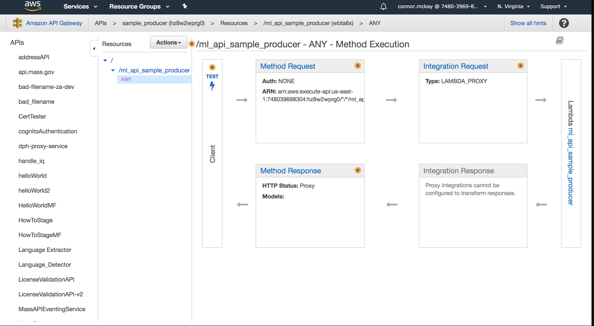

# Creating APIs

This document will serve as a central how-to for creating APIs for the Data Office (or Digital Services as a whole). This guide is meant to be an opinionated guide on creating APIs in AWS, it is not meant to be an intro to APIs or a guide on any particular API flavor, although we will follow relevant standards in place in digital services, like [JSON API](http://jsonapi.org/) where appropriate. 

This guide currently leverages only Python for code examples, though examples from other languages currently being used by Digital Services are welcome as pull requests!
This guide also will assume the reader is on a mac with [`brew` installed](brew.sh) examples for systems such as linux are welcome as PRs! 

## Contents

1. [Quickstart Guide](#quickstart-guide)

2. [Serverless](#serverless)

    1. [Creating Derivatives for AWS Lambda](#creating-derivatives-for-aws-lambda)

3. [Server-based with Docker and ELB](#server-based-with-docker-and-elb)


## Quickstart Guide
This guide will show you how to create a simple 1 lambda api which uses `sklearn` to produce a 2 class sample and serve it from an API stood up via the API Gateway.

### Prereqs
Install the following or ensure these are installed on your local system:
Python 2.7

[`pip`](https://pip.pypa.io/en/stable/installing/)

Then run the following:

```bash
# python modules
pip install aws-cli
pip install flask
pip install boto3

# install apex
curl https://raw.githubusercontent.com/apex/apex/master/install.sh | sudo sh
```

Then run:
```
aws configure
```

Note: you will need a valid aws profile with your client and secret tokens handy.

Now let's create a new api `sample_producer` which will use `sklearn` to produce a sample of data.

```bash
mkdir ml_api
cd ml_api
apex init
```

1. Supply the name `sample_producer` for `Project name`

2. (Optional) Enter a short description of the api

```bash
cd functions/
rm -r hello
mkdir sample_producer  # note you want to make meaningful function names in the case of many lambdas in one project
```

Get the module derivatives we will need to run our lambda. See more on this below

```bash
cd sample_producer
aws s3 cp s3://mdo-artifacts/lambda/python_2.7/sklearn_numpy_scipy.zip ./
unzip sklearn_numpy_scipy.zip
rm sklearn_numpy_scipy.zip
rm -r __MACOSX  # not sure why this is here
```

Now create a `function.json` configuration file describing the function for apex:

```json
{
    "description": "function which produces a sample from sklearn",
    "runtime": "python2.7",
    "memory": 128,
    "timeout": 30,
    "handler": "sample.handle"    
}
```

now create `sample.py`:
```python
from sklearn.datasets import make_classification
import logging
import json
import os

# logs automatically go to cloudwatch
logger = logging.getLogger()
logger.setLevel(logging.INFO)

# you can use env vars like so
N_CLASSES = os.environ.get('N_CLASSES')


def create_payload(n_classes=N_CLASSES):
    '''
    create json payload of sample feature vectors
    '''
    logger.info('drawing sample')
    X, y = make_classification(n_features=2, n_redundant=0, n_informative=2,
            random_state=0, n_clusters_per_class=1, n_classes=int(n_classes))
    logger.info('creating blank payload')
    payload = {
        'statusCode': 200,
        'headers': {}
    }
    body = {}
    for index, column in enumerate(X.T):
        body['vec_{}'.format(index)] = list(column)
    body['target'] = list(y)
    payload['body'] = json.dumps(body)  # body must be string
    logger.info('created payload {}'.format(json.dumps(payload, indent=2)))
    return payload


def handle(event, context):
    '''
    main function for sample producer lambda
    '''
    event_string = json.dumps(event, indent=2)
    logger.info('received event {}'.format(event_string))
    payload = create_payload()
    return payload
```
finally `cd` back up to the root project dir and run `apex deploy -s N_CLASSES=2`. The `s` flag allows us to set environmental variables when deploying.

Log in to the AWS console go to lambda and find the function named `ml_api_sample_producer` and create a random test, the body does no matter. Test the lambda and notice the output. 

Now we need to place the api gateway in front of this lambda so we can expose it over http and put proper controls in place.

1. Log in to the AWS console and navigate to the lambda dashboard and select Functions


2. Select your function and under "Add Triggers" click API Gateway


3. Click the "Configuration Required" link and fill out the form. Of interest is the stage and security. Stage should be one of prod, stage, dev for official api stages or some personal name for testing. Security is normally set to "Open with access key" for our normally deployed services, you can set this as appropriate for your app.


4. Click Save

5. Navigate to the API gateway dashboard



6. Click the "Test" button above the lightning bolt

You should see the results in the console. Further work on this is beyond the scope of this guide however next steps would include:

1. Creating an API key for development and testing purposes

2. Error handling and response codes

3. Creating logic for and implementing the GET method, or other methods as appropriate.

## Serverless

This section will discuss constructing APIs according to the "serverless" paradigm, which comes with it's own peculiarities and requirements. 

### Creating Derivatives for AWS Lambda

### Keeping Lambdas "Warm"

In order to ensure reponsive service, Lambda functions must be used often to ensure AWS does not reprovision the hardware the Lambda is running on. If this reprovisioning happens the next client call to the lambda will need to wait until the lambda's hardware is reprovisioned and ready to use for the call to fully execute and return. This typically means around 2 seconds of latency, which is unacceptable for most APIs.

The solution is pinging the lambda on a schedule using AWS cloudwatch. The following steps describe how to set this up:

1. Log in to the aws console

2. Go to the Cloudwatch dashboard

3. Under Events click "Rules" 

4. Click "Create Rule"

5. Under Event Source select "Schedule" and "Fixed Rate" set to a rate between 1 and 10 minutes

6. Under Targets select "Lambda Function" and select the function we want to keep warm

7. Click "configure details" then give the rule a name and save


